  

# 🛒 Awesome Retail Inventory Management

       

---

### 🌟 Curated Directory of Enterprise SaaS Solutions & Open-Source Software for Retail Stock Control

> A comprehensive, SEO-optimized guide to **Retail Inventory Management**, **Multi-Channel Order Sync**, **Warehouse Stock Control**, **Supply Chain Logistics**, **Barcode Scanning**, and **Manufacturing Bill of Materials (BOM)**.

**Last updated**: September 2026

Modern retail, ecommerce, and omnichannel commerce depend on flawless real-time stock synchronization across physical storefronts, warehouses, and online marketplaces (Amazon, Shopify, Walmart, eBay). This curated repository tracks the leading **commercial SaaS platforms** (ranked by business scale) and the top **open-source GitHub repositories** (ranked by developer community adoption).

---

## 📑 Table of Contents

- [🏢 SaaS / Hosted Commercial Platforms](#-saas--hosted-commercial-platforms)
  - [📊 Market Dynamics & Size](#-market-dynamics--size)
  - [🏷️ SaaS Platform Comparison Table](#️-saas-platform-comparison-table)
- [💻 Open-Source GitHub Projects](#-open-source-github-projects)
- [🧩 Functional Extensions & Ecosystem](#-functional-extensions--ecosystem)
- [🤝 How to Contribute](#-how-to-contribute)
- [📈 Star History](#-star-history)
- [⚖️ Disclaimer](#️-disclaimer)

---

## 🏢 SaaS / Hosted Commercial Platforms

### 📊 Market Dynamics & Size
> 💡 **Market Size & Structure**: The global retail inventory management software market is estimated at **$3.5B to $7.3B** (projected to surpass **$10.5B+ by 2026–2028** at a ~10–12% CAGR). The sector is **moderately fragmented** rather than a winner-take-all monopoly: enterprise-level legacy ERP suites (Oracle, SAP, Microsoft Dynamics, NetSuite) coexist with specialized mid-market cloud platforms, agile DTC multichannel inventory engines, and boutique warehouse stock systems.

### 🏷️ SaaS Platform Comparison Table
*Ranked in descending order by company size (annual revenue / valuation):*

| Platform / Product | Company Size (Revenue / Valuation) | Description | Starting Pricing | Free Tier / Trial Limits |
| :--- | :--- | :--- | :--- | :--- |
| **[Zoho Inventory](https://www.zoho.com/inventory/)** | **~$1.5B ARR / $10B+ Valuation** (₹12,313 Cr global revenue) | Omnichannel inventory, order management, and shipping platform deeply integrated with the Zoho ecosystem. | Free plan ($0) or $29/month (Standard tier, billed annually / $39/mo billed monthly) | Free forever plan: 50 orders/month, 50 shipping labels/month, 1 user, 1 organization, 2 warehouse locations; 14-day free trial on paid tiers |
| **[Unleashed](https://www.unleashedsoftware.com/)** | **~$1.5B (£1.2B) ARR / £9.2B ($11.8B) Valuation** (The Access Group) | Cloud inventory and stock control software built for wholesalers, distributors, and manufacturers with batch and serial tracking. | $399/month (Core tier; includes 3 users and core inventory features) | 14-day free trial with full access to all features and unlimited products/transactions (no credit card required) |
| **[Finale Inventory](https://www.finaleinventory.com/)** | **$651M Revenue / ~$6.4B Market Cap** (Descartes Systems Group, NASDAQ: DSGX) | High-volume inventory and cloud warehouse management system with turnkey barcode scanning and multichannel sales synchronization. | $99/month (Starter tier; includes 1 user, 1 integration, up to 500 orders/month) | 14-day free trial with full access to standard inventory features and up to 500 orders (no credit card required) |
| **[Cin7 Core](https://www.cin7.com/)** | **$500M Continuation Fund / ~$36M+ ARR** (Rubicon Technology Partners) | Cloud inventory and order management platform with multi-warehouse tracking, B2B portal, and native manufacturing/BOM capabilities. | $349/month (Standard tier; includes 5 users and 2 integrations) | 14-day free trial with full access to standard features and up to 5 users (no credit card required) |
| **[Fishbowl Inventory](https://www.fishbowlinventory.com/)** | **$100M+ PE Acquisition Valuation / ~$31.7M ARR** (Diversis Capital) | Inventory and warehouse management system with QuickBooks/Xero synchronization, barcode scanning, and multi-location tracking. | $229/month (Essentials tier, billed annually; includes 2 users and real-time inventory tracking) | 14-day free trial with interactive sandbox demo environment pre-populated with sample inventory data |
| **[SkuVault Core](https://www.skuvault.com/)** | **~$26M–$55.9M ARR / $18B+ GMV Managed** (Linnworks / Marlin Equity Partners) | Warehouse management and inventory system tailored for ecommerce sellers to prevent stockouts and streamline picking/packing. | $299/month (Growth tier; base subscription scales by sales order volume) | 14-day guided trial / sandbox environment provided upon sales demo request (no open self-serve tier) |
| **[Katana Cloud Inventory](https://katanamrp.com/)** | **~$150M–$200M Valuation / €60M+ ($65M+) Funding** (~$15M ARR) | Visual inventory and manufacturing MRP software for makers and scaling brands, offering live shop floor control and batch tracking. | Free plan ($0) or $299/month (Core tier, billed annually; unlimited SKUs and users) | Free forever plan for up to 30 SKUs; 15-day free trial with unlimited SKUs and full feature access (no credit card required) |
| **[inFlow Inventory](https://www.inflowinventory.com/)** | **~$12.2M ARR / $16.7M Funding** (Archon Systems) | All-in-one inventory and order management system with B2B showroom, barcode scanning, purchasing, and BOM assembly. | $129/month (Entrepreneur tier, billed annually / $161/mo billed monthly; up to 100 orders/mo, 2 users) | 14-day free trial with full feature access, up to 100 sales orders, 1 location, 2 team members (no credit card required) |
| **[Cin7 Orderhive](https://www.cin7.com/)** | **Merged into Cin7 ($500M Fund Valuation / ~$36M ARR)** | Legacy multi-channel order and inventory platform; now integrated into Cin7 Core. | Historically $44.99/month (migrated into Cin7 Core starting at $349/month) | Legacy 15-day trial; new accounts are onboarded via Cin7 Core's 14-day free trial |
| **[Ordoro](https://www.ordoro.com/)** | **~$3.8M ARR / $4.8M Total Funding** | Multichannel inventory management and shipping app with automated order routing, kitting, and dropshipping vendor portals. | Free plan ($0 for shipping) or $349/month (Inventory tier; $299/mo for Dropshipping) | Free forever plan for shipping (Essentials tier); 15-day free trial for Inventory and automation features (no credit card required) |
| **[Sortly](https://www.sortly.com/)** | **~$3.1M ARR** (PeakSpan Capital Backed) | Visual, mobile-first inventory tracking system with custom QR code/barcode generation and visual asset categorization. | Free plan ($0) or $24/month (Advanced tier, billed annually / $49/mo billed monthly) | Free forever plan: up to 100 entries/items, 1 custom user, 1 location; 14-day free trial on paid plans |
| **[Megaventory](https://www.megaventory.com/)** | **~$1.3M Annual Revenue** (Self-Funded / Bootstrapped) | Mid-tier cloud inventory, order fulfillment, and light manufacturing management software with multi-location stock tracking. | $135/month (Pro tier, billed annually / $150/mo billed monthly) | 15-day free trial with full access for up to 5 users, 20 locations, 20,000 products, and 20,000 transactions (no credit card required) |

---

## 💻 Open-Source GitHub Projects

*Ranked in descending order by GitHub Stars. Badges display real-time community engagement and link directly to stargazers.*

1. **[Odoo](https://github.com/odoo/odoo)**   
   Enterprise-class open-source suite of business apps featuring double-entry warehouse management, automated replenishment rules, cross-docking, drop-shipping, and built-in barcode scanner workflows. Built with Python, JavaScript, and PostgreSQL.

2. **[ERPNext](https://github.com/frappe/erpnext)**   
   100% complete open-source ERP system featuring multi-location inventory, automated reorder levels, serial and batch tracking, landed cost wizards, multi-currency retail billing, and POS terminal integration. Built on the Frappe framework.

3. **[Snipe-IT](https://github.com/snipe/snipe-it)**   
   Widely adopted open-source asset and inventory management system designed for tracking equipment, retail accessories, consumable stock, QR/barcode generation, and audit verification. Built with PHP and Laravel.

4. **[Akaunting](https://github.com/akaunting/akaunting)**   
   Free and modular open-source accounting and business management platform with native inventory tracking, stock adjustments, vendor purchasing, order fulfillment, and multi-currency support.

5. **[Grocy](https://github.com/grocy/grocy)**   
   Web-based self-hosted stock and inventory management platform featuring barcode scanning, expiration date tracking, batch quantities, automated shopping lists, and a comprehensive REST API.

6. **[InvenTree](https://github.com/inventree/InvenTree)**   
   Modern, powerful open-source stock and component inventory management system with hierarchical location trees, BOM tracking, supplier part catalogues, extensible plugins, and a React frontend. Built on Django and Python.

7. **[Homebox](https://github.com/sysadminsmedia/homebox)**   
   Lightweight, blazing-fast self-hosted inventory and asset management application written in Go. Features customizable item fields, location hierarchies, label printing, QR code scanning, and SQLite/PostgreSQL backends.

8. **[Open Source Point of Sale (OSPOS)](https://github.com/opensourcepos/opensourcepos)**   
   Web-based point of sale and inventory management application designed for small independent retailers. Includes item stock counts, barcode scanning, sales receipts, customer profiling, and reporting.

9. **[metasfresh](https://github.com/metasfresh/metasfresh)**   
   Scalable open-source ERP system engineered for industrial and wholesale inventory. Offers high-volume inventory handling, multi-warehouse logistics, EDI integrations, and automated replenishment.

10. **[PartKeepr](https://github.com/partkeepr/PartKeepr)**   
    Electronic component and stock inventory management system supporting parametric searches, distributor data linkages, stock tracking, and nested storage locations.

11. **[OpenBoxes](https://github.com/openboxes/openboxes)**   
    Supply chain, warehouse, and inventory management system designed for healthcare, humanitarian, and institutional distribution. Features lot and expiry tracking, bin locations, and stock requisitions.

12. **[OpenQuarterMaster](https://github.com/Epic-Breakfast-Productions/OpenQuarterMaster)**   
    Extensible open-source inventory management platform designed for modular stock control, customizable assets, plugin support, and clear API-driven operations.

13. **[Celerp](https://github.com/celerp/celerp)**   
    Self-hosted desktop ERP suite providing multi-location stock tracking, barcode operations, purchasing, manufacturing, and offline functionality without mandatory cloud services.

14. **[OpenStock](https://github.com/ospos-org/open-stock)**   
    Lightweight, high-performance open-source stock controller and retail inventory management API written in Rust with MySQL storage, covering purchase orders, stock transfers, and point-of-sale transactions.

15. **[MyCompany / lsFusion](https://mycompany.lsfusion.org/)**  
    Open-source modular business suite providing multi-warehouse stock management, lot and serial tracking, purchasing, and sales order fulfillment.

---

## 🧩 Functional Extensions & Ecosystem

- 🏷️ **Barcode & Label Printing**: Open tools and drivers for Zebra (ZPL), ESC/POS, and Brother thermal printers for inventory tagging.
- 🔄 **Omnichannel Connectors**: Middleware syncing inventory stock levels between warehouse databases and Shopify, WooCommerce, Amazon, and eBay.
- ⚙️ **Manufacturing & BOM**: Assembly kitting plugins adding bill-of-materials and work-order management on top of basic item catalogs.
- 📊 **Demand Forecasting & BI**: Open analytics engines (Metabase, Apache Superset) connected to inventory databases for safety stock and cycle counting.
- 📱 **Mobile Warehouse Picking**: Progressive Web Apps (PWAs) and Android handheld terminal apps for wave picking, packing, and receiving.

---

## 🤝 How to Contribute

1. Fork the repository.
2. Add or update entries in `README.md` (keep entries objective and accurately verified).
3. Provide: platform/tool name, official link, pricing/open-source license, star count, and a 1–2 sentence operational summary.
4. Submit a Pull Request with clear release notes.

⭐ Star this repository to help other engineers and retail operators discover the best stock control tools!

---

## 📈 Star History

---

## ⚖️ Disclaimer

- This is a **community-curated index** for informational purposes — not an endorsement of any vendor or software suite.
- Inventory systems are mission-critical. Stock count accuracy, automated reordering, database backups, and channel sync latency directly impact fulfillment and revenue.
- Carefully evaluate total cost of ownership (TCO), hosting requirements, ERP integrations, and support SLAs before deploying in production.

---

  <b>Built for retail operators, ecommerce founders, supply chain managers, and warehouse teams worldwide.</b> 
  Curated with ❤️ by <a href="https://github.com/ishandutta2007">Ishan Dutta</a>

